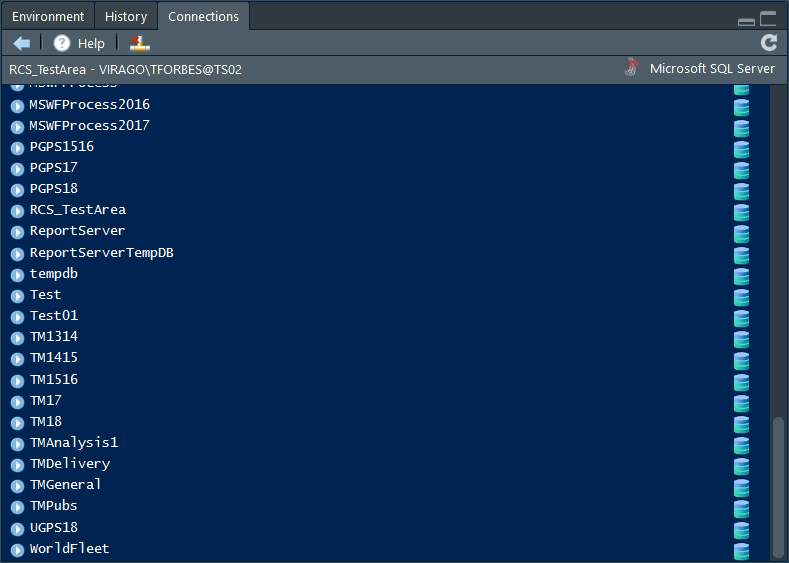
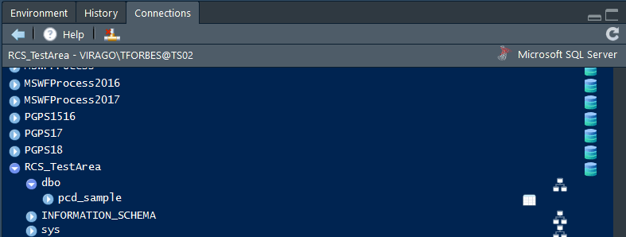
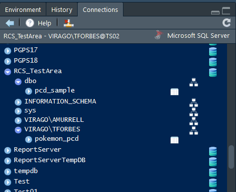
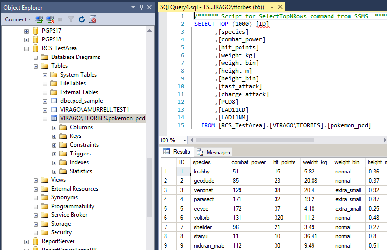
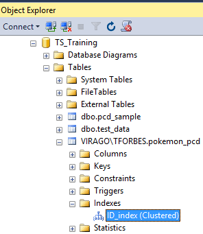
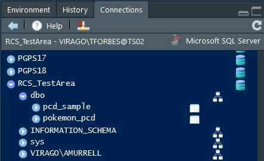

```{r setup, include=FALSE}
knitr::opts_chunk$set(echo = TRUE)

library(tidyverse)

```

### Introduction

R is great for exploring, analysing and visualising data in hundreds of different 
ways.  

SQL databases are ideal for storing data as they are structured, efficient and 
can handle large amounts of data.

A good workflow is to have your data stored in an SQL database and then use R to 
analyse it.


The aim of this session is to demonstrate:  

*  How to connect to an SQL database from R  

*  How to bring data into R using an SQL query    

*  How to write data from R into SQL  

### The data

This demo is based on the **RCS_TestArea** database as it was set up as an 
experimentation area by me when I was in the Road Congestion team, so I know
there is nothing sensitive in there, and I still have read/write access.

This database sits on the **TS02** server, which some of you will have access
to, but not all. 


<br>
The database is called **RCS_TestArea** and contains a public table I have 
put there recently for the purposes of this talk. 
<br>


**pcd_sample** is a 1% sample of the ONS postcode lookup table that can be found on their geoportal here, all ~160MB of it.

https://ons.maps.arcgis.com/home/item.html?id=ef72efd6adf64b11a2228f7b3e95deea

<br>

We are going to focus today on matching a data set that contains postcodes to 
the postcode lookup to add other geographies.

### The DBI and odbc packages

The approach I am recommending requires both the DBI and odbc packages.

```{r warning = FALSE}
library(DBI)
library(odbc)

```

The `DBI` package defines an interface for communication between R and relational 
database management systems (not just SQL but I'm using this as an example as 
most of the data we have is stored in SQL).

We also need the `odbc` package as that provides the driver for SQL databases.


### Advantages of `DBI` and `odbc` over `RODBC`

I had previously always used the `RODBC` package to connect to databases.  Reasons for the move to using `DBI` and `odbc` include:

1. Enables use of the RStudio Connections Pane (see below for more info)

2. I found the `DBI`/`odbc` solution much quicker for writing out to SQL

3. You can use `dbplyr` when your data is too big to work with in memomry with
`dplyr`, or if you are not familiar with SQL.


### Create a connection

Start by creating a connection to the database:

```{r}

conn <- DBI::dbConnect(
  odbc::odbc()
  , .connection_string = "driver={SQl Server};
                          server=TS02; 
                          database=RCS_TestArea"
  )

```


When you have done this you can see the details of the connection to the database in the Connections pane where you usually see the Environment:
<br>
<br>


You can open this up to see more detail on the tables within the database, under **dbo** we just have the one table **pcd_sample**:
<br>
<br>


### Read in data

If you want to send a **SELECT** query to the database you can use the **dbGetQuery()** function. 

For example, this query will bring in just the records where the postcode starts AL1:

```{r}

pcd_al1 <- DBI::dbGetQuery(
  conn
  , "SELECT * FROM [dbo].[pcd_sample] WHERE PCD8 like 'AL1%'"
  )

nrow(pcd_al1)

```

Or you could count the number of different Local Authority Districts:

```{r}

DBI::dbGetQuery(
  conn
  , "SELECT COUNT (distinct LAD11NM) FROM [dbo].[pcd_sample]"
  )

```

If you have a more complicated query you can use `str_c` from the `stringr`
package to concatenate the string:


```{r}

sql_table <- "[dbo].[pcd_sample]"

sql_query <- stringr::str_c(
  "SELECT COUNT(distinct LAD11NM) FROM"
  , sql_table
  )

DBI::dbGetQuery(
  conn
  , sql_query
  )

```

### Joining data

If this example I have a small dataset containing postcodes and I want to add 
local authority information to it by joining it with the **pcd_sample** data.

```{r}

pokemon <- readr::read_csv(
  file = "data/pokemon_pcd.csv"
  )

knitr::kable(pokemon[1:6, ])

```

#### Option 1 - Read the whole SQL table into R

I could read all the Postcode data in to R ready to do the joining:

```{r}
start <- Sys.time()

pcd <- DBI::dbGetQuery(
  conn
  , "SELECT * FROM [dbo].[pcd_sample]"
  )

```


This takes:

```{r}
Sys.time() - start
```

It is potentially slow due to the size of the data. However, I have trimmed this data set down to `r format(nrow(pcd), big.mark = ",")` rows, a mere 1% of the full postcode lookup available.


#### Option 2 - Read just the rows of the SQL table you need into R
We want a solution that does the join without bringing all the data into memory 
in R.  There are a couple of solutions.

For small(ish) datasets like this one we can build up a query containing the list of postcodes:

```{r}

query_string <- stringr::str_c(
  "SELECT PCD8, LAD11CD, LAD11NM FROM [dbo].[pcd_sample] WHERE PCD8 in ('"
  , stringr::str_c(
    pokemon$PCD8
    , collapse = "','")
  , "')"
  )

stringr::str_sub(
  string = query_string
  , start = 1
  , end = 200
)

```

```{r}

pcd_selected <- dbGetQuery(conn, query_string)

knitr::kable(pcd_selected[1:6, ])

```

Now I have the data for just the postcodes I'm interested in and can do a quick join:

```{r}
pokemon_pcd <- dplyr::left_join(
  pokemon
  , pcd_selected
  , by = "PCD8"
  )

knitr::kable(pokemon_pcd[1:6, ])

```

#### Option 3 - Use dbplyr to do the matching in SQL

The dbplyr package is "A 'dplyr' back end for databases that allows you to work 
with remote database tables as if they are in-memory data frames."

```{r, message = FALSE, warning = FALSE}

library(dbplyr)

```

Start by specifying the table you want to connect to:

```{r}

pcd_table <- dplyr::tbl(
  conn
  , in_schema("dbo", "pcd_sample")
  )

```

This is not a dataframe/tibble; it's just a reference to the table:

```{r}

class(pcd_table)

```


We can then use this table reference to construct the SQL query using the standard dplyr functions of select() and filter():

```{r}

start <- Sys.time()

pokemon_pcd_2 <- pcd_table %>%
  dplyr::select(PCD8, LAD11CD, LAD11NM) %>%
  dplyr::filter(PCD8 %in% pokemon$PCD8) %>%
  dplyr::collect() %>%  # This is the point at which the data is retrieved 
                        # from the SQL table
  dplyr::right_join(pokemon, by = "PCD8") 

```

This only took:

```{r} 

Sys.time() - start

``` 

If we break this down to just before the collect() function we can see that dbplyr has effectively taken the dplyr functions we gave it and converted these to an SQL query:

```{r}

pcd_table %>%
  dplyr::select(PCD8, LAD11CD, LAD11NM) %>% 
  dplyr::filter(PCD8 %in% pokemon$PCD8) %>%
  dplyr::show_query()

```


### Write out data

The database we've been using so far might be one you use as a reference database so only some people will have write permissions. If you want to be able to write out the data you are working with to an SQL database you will need write access permission. It's best to have seperate databases; one containing the original reference data that is not editable; and one which contains the outputs of the analysis you do from that original data. As I am using a test database set up specifically for experimentation I am going to continue to use the same database.


Write the joined dataset to my database:

```{r}

DBI::dbWriteTable(
  conn
  , name = "pokemon_pcd"
  , value = pokemon_pcd)

```

You can see it has been written either by looking in the Connections tab, or by checking in SQL itself, you may need to refresh both.

<br>
<br>



If the table already exists and you want to overwrite it, say you wanted to add an ID column to **pokemon_pcd** and call it **pokemon_pcd_2**,

```{r}

pokemon_pcd_2 <- pokemon_pcd %>% 
  tibble::rowid_to_column("ID")

```


simply add the `overwrite` argument:

```{r}

DBI::dbWriteTable(
  conn
  , name = "pokemon_pcd"
  , value = pokemon_pcd_2
  , overwrite = TRUE
  )

```

Checking in SQL we can see that the new ID column has been added:
<br>



### Indexing

When creating SQL tables including indexes is a good idea to help speed up searches/queries.

Create the string for the indexing command and then use the **dbSendQuery** function (rather than the **dbGetQuery** function we were using for select queries) to send it to the SQL database.

Below I am creating a unique clustered index on the ID column, which contains unique identifiers. (Don't forget to double up any backslashes!)

```{r}
index_string <- "CREATE UNIQUE CLUSTERED INDEX [ID_index] ON [VIRAGO\\TFORBES].[pokemon_pcd]
                      ([ID] ASC)"

DBI::dbSendQuery(conn, index_string)

```
Checking in SQL we can see that the new unique clustered index now exists:
<br>
<br>


Each table can have 1 clustered index and many non-clustered (logical) indexes.  

A table doesn't have to have a clustered index but it's good to aim to have one.  

A clustered index doesn't have to be unique (you can use 'CREATE CLUSTERED INDEX' instead of 'CREATE UNIQUE CLUSTERED INDEX').  

For example to create an index on multiple columns you might run this:

```{r}

index_string <- 'CREATE NONCLUSTERED INDEX [multiple_index] ON [VIRAGO\\TFORBES].[pokemon_pcd]
                      ( [ID] ASC,
                        [species] ASC
                      )'

DBI::dbSendQuery(conn, index_string)

```

Now we can see that the table has two indexes, one unique *Clustered* and one *Non-unique* and *Non-clustered*.
<br>
<br>


### Changing schema

I have had an issue when writing to some databases where the schema that is used when I write data from R to SQL is effectively my own personal schema which means that no one else can see the table I've generated. This problem should be sorted very soon when updates to `DBI`/`odbc` mean you can specify the scheme when you create the table, however in the meantime the solution is to create the table (as per instructions above) and then send an instruction to change the schema to the standard **dbo** schema:

```{r}

schema_change <- 'ALTER SCHEMA dbo TRANSFER [VIRAGO\\TFORBES].[pokemon_pcd]'

DBI::dbSendQuery(conn, schema_change)

```

Looking in Connections in RStudio we can see that the pokemon_pcd table has moved from **VIRAGO\\TFORBES** to **dbo**
<br>


<br>
Some more on schemas here

https://db.rstudio.com/best-practices/schema/

<br>

### Drop table

I don't want my experiments cluttering up the test area so I'm going to delete the table I just put there:

```{r}

drop_table <- 'DROP TABLE [dbo].[pokemon_pcd];'

DBI::dbSendQuery(conn, drop_table)

```


### Disconnect

It's good practice to disconnect from the SQL connection when you've finished using it.

```{r}

DBI::dbDisconnect(conn)

```

*fin*