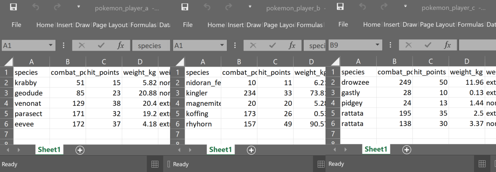
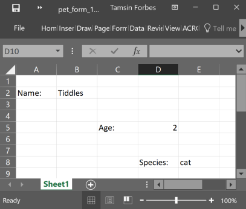
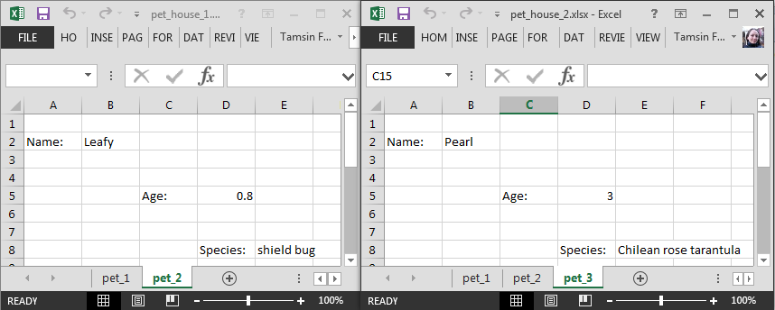

Coffee & Coding: Importing files into R
------------------------------------------
#### Tamsin Forbes
#### 14/06/2019

## Download subfolder

If you don't want to clone the entire Coffee & Coding repo you can use this link (created using [DownGit](https://minhaskamal.github.io/DownGit/#/home)) to download just the ___importing files into R___ subfolder,

[download importing files into R subfolder]()

What follows is an excerpt from the DfT R-cookbook, which is a work in progress. This section focusses mainly on importing data into R from csv and xls/x files. Data may be stored in Excel in many ways and we look at how to extract and combine data stored in rectangular/non-rectangular form, from single and multiple worksheets and workbooks.

# Libraries

```r
library(tidyverse)
library(fs) #cross-platform file systems operations (based on libuv C library)
library(knitr) #general purpose tool for dynamic report generation in R 
library(kableExtra) #presentation of complex tables with customizable styles
library(DT) #presentation of tables (wrapper of JavaScript library DataTables)
library(DBI) #database connection
library(dbplyr) #database connection
library(haven) #for importing/exporting SPSS, Stata, and SAS files
library(bigrquery) #connecting to GCP BigQuery
```

# Star functions

- `readxl::read_excel`
- `readxl::excel_sheets`
- `purrr::map_dfr`
- `purrr::map_dfc`
- `purrr::map2_dfc`
- `fs::dir_ls`


# Navigating folders

A couple of pointers to navigate from your working directory, which, if you're using R projects (it is highly recommended that you do) will be wherever the `.Rproj` file is located 

## Down

To navigate down folders use `/`. The path given below saves the file **my_df.csv** in the **data** folder, which itself is inside the **monthly_work** folder

```r
readr::write_csv(
  x = my_dataframe
  , path = "monthly_work/data/my_df.csv"
)
```

## Up

To go up a folder use `../`. In particular you may need to do this when running Rmarkdown files. Rmarkdown files use their location as the working directory. If you have created an **R** folder, say, to stash all your scripts in, and a **data** folder to stash your data files in, then you will need to go up, before going down...

The path below goes up one folder, then into the **data** folder, where the **lookup_table.csv** is located.

```r
lookup_table <- readr::read_csv(
  file = "../data/lookup_table.csv"
)
```

# Working with files in R

This section focusses on reading in various file types for working on in R memory. 

## .rds

.rds is R's native file format, any object you create in R can be saved as a .rds file. The functions `readRDS` and `saveRDS` are base R functions.

```r
saveRDS(
  object = my_model #specify the R object you want to save
  , file = "2019_0418_my_model.rds" #give it a name, don't forget the file extension
)
```

## .csv

We use the functions `read_csv` and `write_csv` from the `readr` package (which is part of the `tidyverse`). These are a little bit *cleverer* than their base counterparts, however, this cleverness can catch you out.

The file **messy_pokemon_data.csv** contains pokemon go captures data which has been deliberately messed up a bit. `read_csv` imputes the column specification from the first 1000 rows, which is fine if your first 1000 rows are representative of the data type. If not then subsequent data that can't be coerced into the imputed data type will be replaced with NA. 

Looking at the column specification below notice that `read_csv` has recognised **time_first_capture** as a time type, but not **date_first_capture** as date type. Given the information that **combat_power** should be numeric we can see that something is also amiss here as `read_csv` has guessed character type for this column.  

```r
pokemon <- readr::read_csv(
  file = "data/messy_pokemon_data.csv"
)
```

```
## Parsed with column specification:
## cols(
##   species = col_character(),
##   combat_power = col_character(),
##   hit_points = col_integer(),
##   weight_kg = col_double(),
##   weight_bin = col_character(),
##   height_m = col_double(),
##   height_bin = col_character(),
##   fast_attack = col_character(),
##   charge_attack = col_character(),
##   date_first_capture = col_character(),
##   time_first_capture = col_time(format = "")
## )
```

Let's have a quick look at some data from these columns

```r
pokemon %>% 
  dplyr::select(species, combat_power, date_first_capture, time_first_capture) %>% 
  dplyr::arrange(desc(combat_power)) %>% 
  head()
```

```
## # A tibble: 6 x 4
##   species    combat_power date_first_capture time_first_capture
##   <chr>      <chr>        <chr>              <time>            
## 1 electabuzz P962         29/04/2001         08:20             
## 2 pidgey     P95          27/11/1969         21:59             
## 3 drowzee    P613         18/07/1968         10:36             
## 4 bulbasaur  P577         17 June 1997       09:17             
## 5 drowzee    P542         04/07/1928         21:54             
## 6 drowzee    P518         06/09/1950         17:01
```

The pokemon dataset has less than 1000 rows so `read_csv` has 'seen' the letters mixed in with some of the numbers in the **combat_power** column. It has guessed at character type because everything it has read in the column can be coerced to character type.

What if there are more than 1000 rows? For example, say you have a numeric column, but there are some letters prefixed to the numbers in some of the post-row-1000 rows. These values are still meaningful to you, and with some data wrangling you can extract the actual numbers. Unfortunately `read_csv` has guessed at type double based on the first 1000 rows and since character type cannot be coerced into double, these values will be replaced with `NA`. If you have messy data like this the best thing to do is to force `read_csv` to read in as character type to preserve all values as they appear, you can then sort out the mess yourself.

You can specify the column data type using the `col_types` argument. Below I have used a compact string of abbreviations to specify the column types, see the help at `?read_csv` or the `readr` vignette for the full list. You can see I got many parsing failures, which I can access with `problems()`, which is a data frame of the values that `read_csv` was unable to coerce into the type I specified, and so has replaced with NA. 

```r
pokemon <- readr::read_csv(
  file = "data/messy_pokemon_data.csv"
  , col_types = "cdddcdcccDt"
)
```

```
## Warning: 723 parsing failures.
## row # A tibble: 5 x 5 col     row col             expected     actual        file                    expected   <int> <chr>           <chr>        <chr>         <chr>                   actual 1     1 date_first_cap~ "date like " 31 May 1977   'data/messy_pokemon_da~ file 2     2 date_first_cap~ "date like " 24 February ~ 'data/messy_pokemon_da~ row 3     3 date_first_cap~ "date like " 21 June 1924  'data/messy_pokemon_da~ col 4     4 date_first_cap~ "date like " 01 August 19~ 'data/messy_pokemon_da~ expected 5     5 date_first_cap~ "date like " 06 August 19~ 'data/messy_pokemon_da~
## ... ................. ... .......................................................................... ........ .......................................................................... ...... .......................................................................... .... .......................................................................... ... .......................................................................... ... .......................................................................... ........ ..........................................................................
## See problems(...) for more details.
```

```r
# c = character, d = double, D = Date, t = time
tibble::glimpse(pokemon)
```

```
## Observations: 696
## Variables: 11
## $ species            <chr> "abra", "abra", "bellsprout", "bellsprout",...
## $ combat_power       <dbl> 101, 81, 156, 262, 389, 433, 628, 161, 135,...
## $ hit_points         <dbl> 20, 16, 32, 44, 50, 59, 68, 33, 29, 51, 26,...
## $ weight_kg          <dbl> 17.18, 25.94, 5.85, 5.42, 3.40, 6.67, 3.84,...
## $ weight_bin         <chr> "normal", "extra_large", "extra_large", "ex...
## $ height_m           <dbl> 0.85, 1.00, 0.80, 0.82, 0.66, 0.84, 0.78, 0...
## $ height_bin         <chr> "normal", "normal", "normal", "normal", "no...
## $ fast_attack        <chr> "zen_headbutt", "zen_headbutt", "acid", "ac...
## $ charge_attack      <chr> "shadow_ball", "shadow_ball", "sludge_bomb"...
## $ date_first_capture <date> NA, NA, NA, NA, NA, NA, NA, NA, NA, NA, NA...
## $ time_first_capture <time> 20:59:33, 10:18:40, 08:06:55, 11:18:28, 21...
```

Let's take a look at the problems.

```r
problems(pokemon) %>% 
  head()
```

```
## # A tibble: 6 x 5
##     row col             expected     actual        file                   
##   <int> <chr>           <chr>        <chr>         <chr>                  
## 1     1 date_first_cap~ "date like " 31 May 1977   'data/messy_pokemon_da~
## 2     2 date_first_cap~ "date like " 24 February ~ 'data/messy_pokemon_da~
## 3     3 date_first_cap~ "date like " 21 June 1924  'data/messy_pokemon_da~
## 4     4 date_first_cap~ "date like " 01 August 19~ 'data/messy_pokemon_da~
## 5     5 date_first_cap~ "date like " 06 August 19~ 'data/messy_pokemon_da~
## 6     6 date_first_cap~ "date like " 17 January 1~ 'data/messy_pokemon_da~
```

And since I know that there are problems with **combat_power** let's take a look there.

```r
problems(pokemon) %>% 
  dplyr::filter(col == "combat_power") %>% 
  head()
```

```
## # A tibble: 6 x 5
##     row col          expected actual file                         
##   <int> <chr>        <chr>    <chr>  <chr>                        
## 1    12 combat_power a double P577   'data/messy_pokemon_data.csv'
## 2    96 combat_power a double P458   'data/messy_pokemon_data.csv'
## 3    97 combat_power a double P455   'data/messy_pokemon_data.csv'
## 4    98 combat_power a double P518   'data/messy_pokemon_data.csv'
## 5    99 combat_power a double P348   'data/messy_pokemon_data.csv'
## 6   100 combat_power a double P542   'data/messy_pokemon_data.csv'
```

The `problems()` feature in `read_csv` is super useful, it helps you isolate the problem data so you can fix it.

Other arguments within `read_csv` that I will just mention, with their default settings are

- `col_names = TRUE`: the first row on the input is used as the column names.
- `na = c("", "NA")`: the default values to interpret as `NA`.
- `trim_ws = TRUE`: by default trims leading/trailing white space. 
- `skip = 0`: number of lines to skip before reading data.
- `guess_max = min(1000, n_max)`: maximum number of records to use for guessing column type. NB the bigger this is the longer it will take to read in the data.

 


## .xlsx and .xls

Excel workbooks come in many shapes and sizes. You may have one or many worksheets in one or many workbooks, there may only be certain cells that you are interested in. Below are a few examples of how to cope with these variations using functions from `readxl` and `purrr` to iterate over either worksheets and/or workbooks, the aim being to end up with all the data in a single tidy dataframe.

### Single worksheet - single workbook

The simplest combination, you are interested in one rectangular dataset in a particular worksheet in one workbook. Leaving the defaults works fine on this dataset. Note that `readxl::read_excel` detects if the file is `.xlsx` or `.xls` and behaves accordingly.


```r
readxl::read_excel(path = "data/port0499.xlsx") %>% 
  head()
```

```
## # A tibble: 6 x 9
##    year polu_majorport polu_region direction cargo_group cargo_category
##   <dbl> <chr>          <chr>       <chr>     <chr>                <dbl>
## 1  2000 Aberdeen       Africa (ex~ Inwards   Other Gene~             92
## 2  2000 Aberdeen       Africa (ex~ Outwards  Other Gene~             92
## 3  2000 Aberdeen       Africa (ex~ Outwards  Other Gene~             99
## 4  2000 Aberdeen       America     Inwards   Other Gene~             91
## 5  2000 Aberdeen       America     Inwards   Other Gene~             92
## 6  2000 Aberdeen       America     Outwards  Other Gene~             99
## # ... with 3 more variables: cargo_description <chr>, tonnage <dbl>,
## #   units <dbl>
```

Let's set a few of the other arguments, run `?read_excel` in the console to see the full list.

```r
readxl::read_excel(
  path = "data/port0499.xlsx"
  , sheet = 1 #number or name of sheet, default is first sheet
  , col_names = TRUE #default
  , col_types = "text" #a single type will recycle to all columns, specify each 
        #using character vector of the same length eg c("numeric", "text", ...)
) %>% 
  head()
```

```
## # A tibble: 6 x 9
##   year  polu_majorport polu_region direction cargo_group cargo_category
##   <chr> <chr>          <chr>       <chr>     <chr>       <chr>         
## 1 2000  Aberdeen       Africa (ex~ Inwards   Other Gene~ 92            
## 2 2000  Aberdeen       Africa (ex~ Outwards  Other Gene~ 92            
## 3 2000  Aberdeen       Africa (ex~ Outwards  Other Gene~ 99            
## 4 2000  Aberdeen       America     Inwards   Other Gene~ 91            
## 5 2000  Aberdeen       America     Inwards   Other Gene~ 92            
## 6 2000  Aberdeen       America     Outwards  Other Gene~ 99            
## # ... with 3 more variables: cargo_description <chr>, tonnage <chr>,
## #   units <chr>
```


### Single worksheet - many workbooks

For example, you collect pokemon go capture data from many different players, the data all has the same structure and you want to read it in and row bind into a single dataframe in R. 



<br/>
The code below collects the names of the 3 excel workbooks using `fs::dir_ls`, and, as these are not the only files in that folder, I've specified them using regular expressions (regex). Then we use `purrr::map_dfr` to iterate and rowbind over this list of files, applying the function we supply, that is `readxl::read_excel`. Since we are only reading a single worksheet per workbook we don't need to supply any arguments to `readxl:read_excel`, the defaults will work fine, each workbook path is piped in, in turn. The `.id` argument in `purrr:map_dfr` adds the file path into a new column, which we have named "player" in this instance. The "dfr" in `map_dfr` refers to the output "data-frame-rowbound".


```r
pokemon <- fs::dir_ls(path = "data", regex = "pokemon_player_.\\.xlsx$")  %>% 
  purrr::map_dfr(.f = readxl::read_excel, .id = "player")

tibble::glimpse(pokemon)
```

```
## Observations: 15
## Variables: 10
## $ player        <chr> "data/pokemon_player_a.xlsx", "data/pokemon_play...
## $ species       <chr> "krabby", "geodude", "venonat", "parasect", "eev...
## $ combat_power  <dbl> 51, 85, 129, 171, 172, 10, 234, 20, 173, 157, 24...
## $ hit_points    <dbl> 15, 23, 38, 32, 37, 11, 33, 20, 26, 49, 50, 10, ...
## $ weight_kg     <dbl> 5.82, 20.88, 20.40, 19.20, 4.18, 6.21, 73.81, 5....
## $ weight_bin    <chr> "normal", "normal", "extra_small", "extra_small"...
## $ height_m      <dbl> 0.36, 0.37, 0.92, 0.87, 0.25, 0.36, 1.52, 0.30, ...
## $ height_bin    <chr> "normal", "normal", "normal", "normal", "normal"...
## $ fast_attack   <chr> "mud_shot", "rock_throw", "confusion", "bug_bite...
## $ charge_attack <chr> "vice_grip", "rock_tomb", "poison_fang", "x-scis...
```

Note that the `regex` argument in `fs::dir_ls` is applied to the full file path so if I had tried to specify that the file name starts with "pokemon" by front anchoring it using "^pokemon" this would return no results, since the full name is actually "data/pokemon...". Helpful regex links below.

[regex cheatsheet](https://www.rstudio.com/wp-content/uploads/2016/09/RegExCheatsheet.pdf)

[stringr cheatsheet including regex](http://edrub.in/CheatSheets/cheatSheetStringr.pdf)

### Many worksheets - single workbook

You have a single workbook, but it contains many worksheets of interest, each containing rectangular data with the same structure. For example, you have a workbook containing pokemon go captures data, where each different data collection point has its own sheet. The data structure, column names and data types are consistent. You want to read in and combine these data into a single dataframe.

The code below sets the location of the workbook and puts this in the object `path`. It then collects the names of all the sheets in that workbook using `readxl::excel_sheets`. Next `purrr::set_names` sets these names in a vector so that they can be used in the next step. This vector of names is implictly assigned to the `.x` argument in `purrr::map_dfr` as it is the first thing passed to it. This means we can refer to it as `.x` in the function we are iterating, in this case `readxl::read_excel`. Finally, an id column is included, made up of the sheet names and named "sheet". The output is a single dataframe with all the sheets row bound together.


```r
path <- "data/multi_tab_messy_pokemon_data.xlsx"
pokemon_collections <- readxl::excel_sheets(path = path) %>% 
  purrr::set_names() %>% 
   purrr::map_dfr(
     ~ readxl::read_excel(path = path, sheet = .x)
     , .id = "sheet"
   )
tibble::glimpse(pokemon_collections)
```
```
Observations: 14
Variables: 10
## $ sheet         <chr> "collection_point_1", "collection_point_1", "collection_point_1", "col…
## $ species       <chr> "jigglypuff", "caterpie", "koffing", "drowzee", "growlithe", "pidgey",…
## $ combat_power  <dbl> 56, 212, 440, 283, 624, 199, 158, 77, 206, 40, 10, 274, 542, 154
## $ hit_points    <dbl> 51, 53, 43, 53, 66, 40, 43, 13, 62, 16, 10, 49, 71, 32
## $ weight_kg     <dbl> 5.55, 1.84, 0.93, 37.03, 24.43, 1.56, 2.94, 10.72, 38.09, 4.71, 3.09, …
## $ weight_bin    <chr> "normal", "extra_small", "normal", "normal", "extra_large", "normal", …
## $ height_m      <dbl> 0.49, 0.28, 0.53, 1.09, 0.80, 0.30, 0.27, 1.48, 1.13, 0.34, 0.29, 0.32…
## $ height_bin    <chr> "normal", "normal", "normal", "normal", "normal", "normal", "normal", …
## $ fast_attack   <chr> "feint_attack", "bug_bite", "acid", "pound", "bite", "quick_attack", "…
## $ charge_attack <chr> "play_rough", "struggle", "sludge_bomb", "psychic", "body_slam", "aeri…
```


### Many worksheets - many workbooks

Now we can use the above two solutions to combine data from many worksheets spread across many workbooks. As before, the data is rectangular and has the same structure. For example, you receive a workbook every month, containing pokemon go captures data, and each data collection point has its own sheet. 


We create a function to import and combine the sheets from a single workbook, and then iterate this function over all the workbooks using `purrr::map_df`.


```r
#function to combine sheets from a single workbook
read_and_combine_sheets <- function(path){
  readxl::excel_sheets(path = path) %>% 
  purrr::set_names() %>% 
   purrr::map_df(
     ~ readxl::read_excel(path = path, sheet = .x)
     , .id = "sheet"
   )
}

#code to iterate over many workbooks
pokemon_monthly_collections <- fs::dir_ls(
  path = "data", regex = "pokemon_2019\\d{2}\\.xlsx$")  %>% 
  purrr::map_df(
    read_and_combine_sheets
    , .id = "month"
    )

tibble::glimpse(pokemon_monthly_collections)
```

```
Observations: 45
Variables: 11
## $ month         <chr> "data/pokemon_201901.xlsx", "data/pokemon_201901.xlsx", "data/pokemon_…
## $ sheet         <chr> "collection_point_1", "collection_point_1", "collection_point_1", "col…
## $ species       <chr> "horsea", "geodude", "drowzee", "eevee", "goldeen", "eevee", "ekans", …
## $ combat_power  <dbl> 119, 225, 213, 234, 59, 44, 95, 195, 44, 91, 101, 81, 156, 262, 389, 2…
## $ hit_points    <dbl> 21, 38, 46, 46, 19, 19, 24, 40, 21, 17, 20, 16, 32, 44, 50, 10, 29, 52…
## $ weight_kg     <dbl> 4.62, 18.16, 25.17, 5.33, 10.83, 9.82, 5.20, 6.02, 41.36, 5.40, 17.18,…
## $ weight_bin    <chr> "extra_small", "normal", "normal", "normal", "extra_small", "extra_lar…
## $ height_m      <dbl> 0.29, 0.40, 0.85, 0.30, 0.54, 0.34, 1.93, 0.28, 1.09, 0.38, 0.85, 1.00…
## $ height_bin    <chr> "extra_small", "normal", "normal", "normal", "normal", "normal", "norm…
## $ fast_attack   <chr> "bubble", "tackle", "pound", "tackle", "mud_shot", "tackle", "acid", "…
## $ charge_attack <chr> "bubble_beam", "rock_slide", "psychic", "body_slam", "horn_attack", "d…
```

### Non-rectangular data - single worksheet - single workbook

You have received some kind of data entry form that has been done in excel in a more human readable, rather than machine readable, format. Some of the cells contain instructions and admin data so you only want the data held in specific cells. This is non-rectangular data, that is, the data of interest is dotted all over the place. In this example we have pet forms, and the data of interest is in cells **B2**, **D5** and **E8** only.

Here's an image of what the data looks like.



Let's see what we get if we naively try to read it in.

```r
readxl::read_excel(
  path = "data/pet_form_1.xlsx"
) %>% 
  knitr::kable() %>% 
  kableExtra::kable_styling(full_width = F, position = "left")
```

<table class="table" style="width: auto !important; ">
 <thead>
  <tr>
   <th style="text-align:left;"> Name: </th>
   <th style="text-align:left;"> Tiddles </th>
   <th style="text-align:left;"> X__1 </th>
   <th style="text-align:left;"> X__2 </th>
   <th style="text-align:left;"> X__3 </th>
  </tr>
 </thead>
<tbody>
  <tr>
   <td style="text-align:left;"> NA </td>
   <td style="text-align:left;"> NA </td>
   <td style="text-align:left;"> NA </td>
   <td style="text-align:left;"> NA </td>
   <td style="text-align:left;"> NA </td>
  </tr>
  <tr>
   <td style="text-align:left;"> NA </td>
   <td style="text-align:left;"> NA </td>
   <td style="text-align:left;"> NA </td>
   <td style="text-align:left;"> NA </td>
   <td style="text-align:left;"> NA </td>
  </tr>
  <tr>
   <td style="text-align:left;"> NA </td>
   <td style="text-align:left;"> NA </td>
   <td style="text-align:left;"> Age: </td>
   <td style="text-align:left;"> 2 </td>
   <td style="text-align:left;"> NA </td>
  </tr>
  <tr>
   <td style="text-align:left;"> NA </td>
   <td style="text-align:left;"> NA </td>
   <td style="text-align:left;"> NA </td>
   <td style="text-align:left;"> NA </td>
   <td style="text-align:left;"> NA </td>
  </tr>
  <tr>
   <td style="text-align:left;"> NA </td>
   <td style="text-align:left;"> NA </td>
   <td style="text-align:left;"> NA </td>
   <td style="text-align:left;"> NA </td>
   <td style="text-align:left;"> NA </td>
  </tr>
  <tr>
   <td style="text-align:left;"> NA </td>
   <td style="text-align:left;"> NA </td>
   <td style="text-align:left;"> NA </td>
   <td style="text-align:left;"> Species: </td>
   <td style="text-align:left;"> cat </td>
  </tr>
</tbody>
</table>

It's not what we wanted, let's try again, now using the `range` argument

```r
readxl::read_excel(
  path = "data/pet_form_1.xlsx"
  , col_names = FALSE
  , range = "A2:B2"
) %>% 
 knitr::kable() %>% 
 kableExtra::kable_styling(full_width = F, position = "left")
```

<table class="table" style="width: auto !important; ">
 <thead>
  <tr>
   <th style="text-align:left;"> X__1 </th>
   <th style="text-align:left;"> X__2 </th>
  </tr>
 </thead>
<tbody>
  <tr>
   <td style="text-align:left;"> Name: </td>
   <td style="text-align:left;"> Tiddles </td>
  </tr>
</tbody>
</table>

The `range` argument helps, we have picked up one bit of the data, and its name. The `range` argument uses the `cellranger` package which allows you to refer to ranges in Excel files in Excel style. However, we have 3 disconnected data points, we need to iterate, so it's `purrr` to the rescue once more.

The code below demonstrates explicitly that the `.x` argument in `purrr::map_dfr` takes the vector of things that will be iterated over in the supplied function. In this case we are giving the `range` argument of `readxl::read_excel` three individual cells to iterate over. These will then be rowbound so we end up with a single dataframe comprising a single column, named "cells", containing 3 rows.

```r
pet_details <- purrr::map_dfr(
    .x = c("B2", "D5", "E8")
    , ~ readxl::read_excel(
      path = "data/pet_form_1.xlsx"
      , range = .x
      , col_names = "cells" #assign name 
      , col_types = "text" #have to use text to preserve all data in single column
    ) 
  )

pet_details 
```

```
## # A tibble: 3 x 1
##   cells  
##   <chr>  
## 1 Tiddles
## 2 2      
## 3 cat
```

```r
pet_details %>% 
  knitr::kable() %>% 
  kableExtra::kable_styling(full_width = F, position = "left")
```

<table class="table" style="width: auto !important; ">
 <thead>
  <tr>
   <th style="text-align:left;"> cells </th>
  </tr>
 </thead>
<tbody>
  <tr>
   <td style="text-align:left;"> Tiddles </td>
  </tr>
  <tr>
   <td style="text-align:left;"> 2 </td>
  </tr>
  <tr>
   <td style="text-align:left;"> cat </td>
  </tr>
</tbody>
</table>

This is an improvement, we have a dataframe named `pet_details` comprising a single "cells" column, which contains all the relevant data from this worksheet. 

We could now try to reshape it, however, a better idea is to use `map_dfc` since we actually want to column bind these data rather than rowbind them. The read out from `tibble::glimpse` shows that the different variable types have been picked up, which is also helpful. The default naming of the columns gives a clue as to how the function works. 


```r
pet_details <- purrr::map_dfc(
  .x = c("B2", "D5", "E8") #vector of specific cells containing the data
  , ~ readxl::read_excel(
    path = "data/pet_form_1.xlsx"
    , range = .x
    , col_names = FALSE
  ) 
)

tibble::glimpse(pet_details)
```

```
## Observations: 1
## Variables: 3
## $ X__1  <chr> "Tiddles"
## $ X__11 <dbl> 2
## $ X__12 <chr> "cat"
```

<table class="table" style="width: auto !important; ">
 <thead>
  <tr>
   <th style="text-align:left;"> X__1 </th>
   <th style="text-align:right;"> X__11 </th>
   <th style="text-align:left;"> X__12 </th>
  </tr>
 </thead>
<tbody>
  <tr>
   <td style="text-align:left;"> Tiddles </td>
   <td style="text-align:right;"> 2 </td>
   <td style="text-align:left;"> cat </td>
  </tr>
</tbody>
</table>

This is pretty close to what we want, the only sticking point is that we still don't have the correct column names. We could deal with this using `dplyr::rename`, but an even better idea is to use `purrr::map2_dfc`. The `map2` variant allows you to iterate over two arguments simultaneously (into the same function).


```r
pet_details_2 <- purrr::map2_dfc(
  .x = c("B2", "D5", "E8") #vector of specific data cells
  , .y = c("Name", "Age", "Species") #vector of column names
  , ~ readxl::read_excel(
    path = "data/pet_form_1.xlsx"
    , range = .x
    , col_names = .y
  ) 
)

tibble::glimpse(pet_details_2)
```

```
## Observations: 1
## Variables: 3
## $ Name    <chr> "Tiddles"
## $ Age     <dbl> 2
## $ Species <chr> "cat"
```

<table class="table" style="width: auto !important; ">
 <thead>
  <tr>
   <th style="text-align:left;"> Name </th>
   <th style="text-align:right;"> Age </th>
   <th style="text-align:left;"> Species </th>
  </tr>
 </thead>
<tbody>
  <tr>
   <td style="text-align:left;"> Tiddles </td>
   <td style="text-align:right;"> 2 </td>
   <td style="text-align:left;"> cat </td>
  </tr>
</tbody>
</table>

### Non-rectangular data - single worksheet - many workbooks

Having solved for one workbook and worksheet, we can functionalise and iterate to gather the data from every wookbook, two of which are shown below.


<br/>
The function `cells_to_rows` below iterates over `read_excel` reading each of the three cells from the worksheet, applying the corresponding column name as it goes. It takes three character or character vector inputs, `path`, `cells`, and `col_names`.


```r
cells_to_rows <- function(path, cells, col_names){
  purrr::map2_dfc(
    .x = cells
    , .y = col_names
    , ~ readxl::read_excel(
      path = path
      , range = .x
      , col_names = .y
    ) 
  )
}
```

Let's test it on the first pet form data, first setting the paramaters to use in the function. 

```r
path <- "data/pet_form_1.xlsx"
cells <- c("B2", "D5", "E8")
col_names <- c("Name", "Age", "Species")

pet_form_1 <- cells_to_rows(
  path = path, cells = cells, col_names = col_names
  )

pet_form_1
```

```
## # A tibble: 1 x 3
##   Name      Age Species
##   <chr>   <dbl> <chr>  
## 1 Tiddles     2 cat
```

<table class="table" style="width: auto !important; ">
 <thead>
  <tr>
   <th style="text-align:left;"> Name </th>
   <th style="text-align:right;"> Age </th>
   <th style="text-align:left;"> Species </th>
  </tr>
 </thead>
<tbody>
  <tr>
   <td style="text-align:left;"> Tiddles </td>
   <td style="text-align:right;"> 2 </td>
   <td style="text-align:left;"> cat </td>
  </tr>
</tbody>
</table>

It works! So now we can iterate this over all the pet form workbooks, specifying the paths using regex as before. Note below we use `.x` in the `path` argument in the `cells_to_rows` function to refer to the vector of paths piped to `purrr::map_dfr` from `fs::dir_ls`. 

```r
cells <- c("B2", "D5", "E8")
col_names <- c("Name", "Age", "Species")

all_pet_forms <- fs::dir_ls(
  path = "data", regex = "pet_form_\\d\\.xlsx$")  %>% 
  purrr::map_dfr(
    ~ cells_to_rows(path = .x, cells = cells, col_names = col_names)
    , .id = "path"
    )

all_pet_forms
```

```
## # A tibble: 4 x 4
##   path                 Name        Age Species
##   <chr>                <chr>     <dbl> <chr>  
## 1 data/pet_form_1.xlsx Tiddles     2   cat    
## 2 data/pet_form_2.xlsx Woof        1   dog    
## 3 data/pet_form_3.xlsx Hammy       0.5 hamster
## 4 data/pet_form_4.xlsx Toothless   3   dragon
```

<table class="table" style="width: auto !important; ">
 <thead>
  <tr>
   <th style="text-align:left;"> path </th>
   <th style="text-align:left;"> Name </th>
   <th style="text-align:right;"> Age </th>
   <th style="text-align:left;"> Species </th>
  </tr>
 </thead>
<tbody>
  <tr>
   <td style="text-align:left;"> data/pet_form_1.xlsx </td>
   <td style="text-align:left;"> Tiddles </td>
   <td style="text-align:right;"> 2.0 </td>
   <td style="text-align:left;"> cat </td>
  </tr>
  <tr>
   <td style="text-align:left;"> data/pet_form_2.xlsx </td>
   <td style="text-align:left;"> Woof </td>
   <td style="text-align:right;"> 1.0 </td>
   <td style="text-align:left;"> dog </td>
  </tr>
  <tr>
   <td style="text-align:left;"> data/pet_form_3.xlsx </td>
   <td style="text-align:left;"> Hammy </td>
   <td style="text-align:right;"> 0.5 </td>
   <td style="text-align:left;"> hamster </td>
  </tr>
  <tr>
   <td style="text-align:left;"> data/pet_form_4.xlsx </td>
   <td style="text-align:left;"> Toothless </td>
   <td style="text-align:right;"> 3.0 </td>
   <td style="text-align:left;"> dragon </td>
  </tr>
</tbody>
</table>


### Non-rectangular data - many worksheets - single workbook

Now we have more than one worksheet in a single workbook, and the data looks like this, the workbook is from a "pet house" and each worksheet is pet details.


<br/>

To incorporate the worksheets element we rejig the `cells_to_rows` function from above and give it a "sheet" argument, so it can be passed a specific sheet.


```r
sheet_cells_to_rows <- function(path, sheet, cells, col_names){
  purrr::map2_dfc(
    .x = cells
    , .y = col_names
    , ~ readxl::read_excel(
      path = path
      , sheet = sheet
      , range = .x
      , col_names = .y
    ) 
  )
}
```

We now have the function `sheet_cells_to_rows` that can accept a list of worksheet names. As before we use `readxl::excel_sheets` to collect the worksheet names, first setting the other parameters

```r
path <- "data/pet_house_1.xlsx"
cells <- c("B2", "D5", "E8")
col_names <- c("Name", "Age", "Species")

pet_house_1 <- readxl::excel_sheets(path = path) %>% 
  purrr::set_names() %>% 
  purrr::map_dfr(
    ~ sheet_cells_to_rows(path = path
                          , sheet = .x
                          , cells = cells
                          , col_names = col_names)
    , .id = "sheet"
  )

pet_house_1
```

```
## # A tibble: 2 x 4
##   sheet Name      Age Species   
##   <chr> <chr>   <dbl> <chr>     
## 1 pet_1 Tiddles   2   cat       
## 2 pet_2 Leafy     0.8 shield bug
```

<table class="table" style="width: auto !important; ">
 <thead>
  <tr>
   <th style="text-align:left;"> sheet </th>
   <th style="text-align:left;"> Name </th>
   <th style="text-align:right;"> Age </th>
   <th style="text-align:left;"> Species </th>
  </tr>
 </thead>
<tbody>
  <tr>
   <td style="text-align:left;"> pet_1 </td>
   <td style="text-align:left;"> Tiddles </td>
   <td style="text-align:right;"> 2.0 </td>
   <td style="text-align:left;"> cat </td>
  </tr>
  <tr>
   <td style="text-align:left;"> pet_2 </td>
   <td style="text-align:left;"> Leafy </td>
   <td style="text-align:right;"> 0.8 </td>
   <td style="text-align:left;"> shield bug </td>
  </tr>
</tbody>
</table>


### Non-rectangular data - many worksheets - many workbooks

Finally we have many workbooks each containing many worksheets, each containing many cells, as before we want to read them in and combine.


<br/>

We could functionalise the code above that reads and combines the cells in many worksheets from a single workbook, but an alternative approach is used below. We create an anonymous function an use that on the fly. This is useful if the function is a one off, and not too complicated. The anonymous function below still depends on the `sheet_cells_to_rows` we created earlier though.


```r
cells <- c("B2", "D5", "E8")
col_names <- c("Name", "Age", "Species")

pet_house_all <- fs::dir_ls(
  path = "data", regex = "pet_house_\\d\\.xlsx$")  %>% 
  purrr::map_dfr(
    function(path){
      readxl::excel_sheets(path = path) %>% 
        purrr::set_names() %>% 
        purrr::map_dfr(
          ~ sheet_cells_to_rows(path = path
                                , sheet = .x
                                , cells = cells
                                , col_names = col_names)
          , .id = "sheet"
        )
    }
    , .id = "path"
  )
```

<table class="table" style="width: auto !important; ">
 <thead>
  <tr>
   <th style="text-align:left;"> path </th>
   <th style="text-align:left;"> sheet </th>
   <th style="text-align:left;"> Name </th>
   <th style="text-align:right;"> Age </th>
   <th style="text-align:left;"> Species </th>
  </tr>
 </thead>
<tbody>
  <tr>
   <td style="text-align:left;"> data/pet_house_1.xlsx </td>
   <td style="text-align:left;"> pet_1 </td>
   <td style="text-align:left;"> Tiddles </td>
   <td style="text-align:right;"> 2.0 </td>
   <td style="text-align:left;"> cat </td>
  </tr>
  <tr>
   <td style="text-align:left;"> data/pet_house_1.xlsx </td>
   <td style="text-align:left;"> pet_2 </td>
   <td style="text-align:left;"> Leafy </td>
   <td style="text-align:right;"> 0.8 </td>
   <td style="text-align:left;"> shield bug </td>
  </tr>
  <tr>
   <td style="text-align:left;"> data/pet_house_2.xlsx </td>
   <td style="text-align:left;"> pet_1 </td>
   <td style="text-align:left;"> Tuuli </td>
   <td style="text-align:right;"> 8.0 </td>
   <td style="text-align:left;"> tiger </td>
  </tr>
  <tr>
   <td style="text-align:left;"> data/pet_house_2.xlsx </td>
   <td style="text-align:left;"> pet_2 </td>
   <td style="text-align:left;"> Sophie </td>
   <td style="text-align:right;"> 4.0 </td>
   <td style="text-align:left;"> cheetah </td>
  </tr>
  <tr>
   <td style="text-align:left;"> data/pet_house_2.xlsx </td>
   <td style="text-align:left;"> pet_3 </td>
   <td style="text-align:left;"> Pearl </td>
   <td style="text-align:right;"> 3.0 </td>
   <td style="text-align:left;"> Chilean rose tarantula </td>
  </tr>
</tbody>
</table>


 
## Formatting xlsx outputs

Use `openxlsx` or MoJ's `xltabr` to create publication ready tables in xlsx.
 
## .sav

Use `haven` to import SPSS, Stata and SAS files.

# Connecting to databases

## SQL

Below are links to DfT Coffee and Coding talks on the subject of connecting R to SQL

[20181114_Connecting_R_to_SQL](https://github.com/departmentfortransport/coffee-and-coding/tree/master/20181114_Connecting_R_to_SQL)

[20190130_SQL_and_Excel_to_R](https://github.com/departmentfortransport/coffee-and-coding/tree/master/20190130_SQL_and_Excel_to_R)


## GCP

### BigQuery

Link below to Coffee and Coding talk on how to use bigrquery to interact with GCP's BigQuery

[20190403_bigrquery](https://github.com/departmentfortransport/coffee-and-coding/tree/master/20190403_bigrquery)
