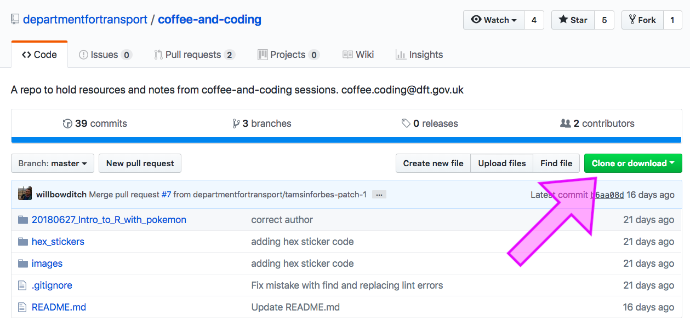
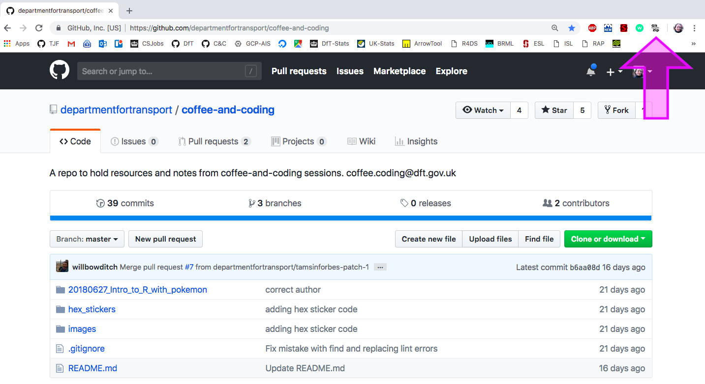
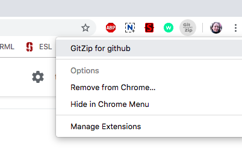
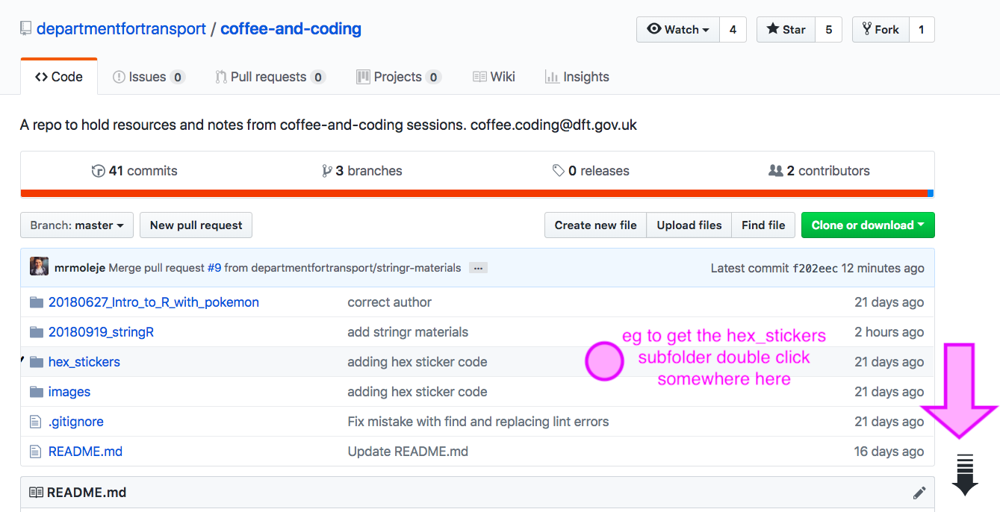
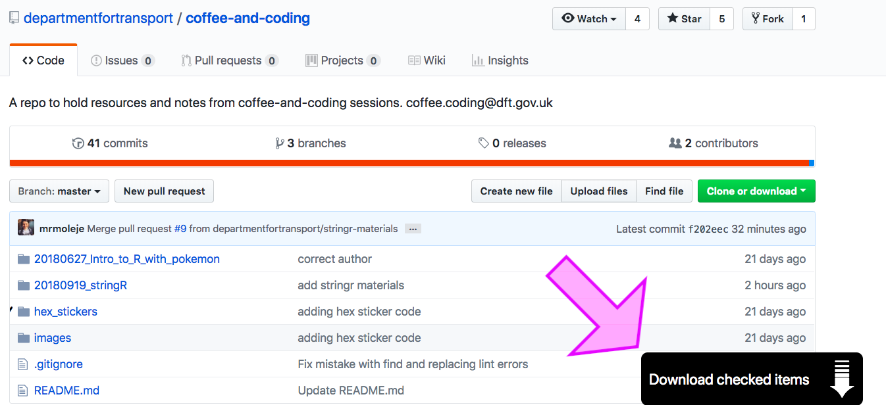

# GitZip Subfolder Download Instructions

##### *Tamsin Forbes*
##### *2018-09-20*

#### Clone or download a repo

GitHub allows you to easily clone or download an entire repo with the nice green 
button:

#### Download a subfolder?
However, if you only want to download a subfolder - there is no button! 
Here's how to do it using GitZip. 

(Prerequisites =  Google Chrome web browser)

##### Step 1

Go to the Chrome Webstore and add GitZip for GitHub Chrome extension 

https://chrome.google.com/webstore/detail/gitzip-for-github/ffabmkklhbepgcgfonabamgnfafbdlkn?hl=en

If successful you will now see the GitZip icon in the top right of you Chrome 
browser

##### Step 2

Click on the icon and click on the first option **GitZip for GitHub** (you may 
need to do this in a new browser tab)

This will take you to an overview of the simple steps to download a subfolder, 
which are esstentially

**Double click on a blank part** of the row the item you want is in and a little black tick will appear to the left of it, also a black arrow will appear
in the bottom right hand corner

 
**Hover over the black arrow** and a "Download checked items" button will appear in the 
right hand corner and click!

