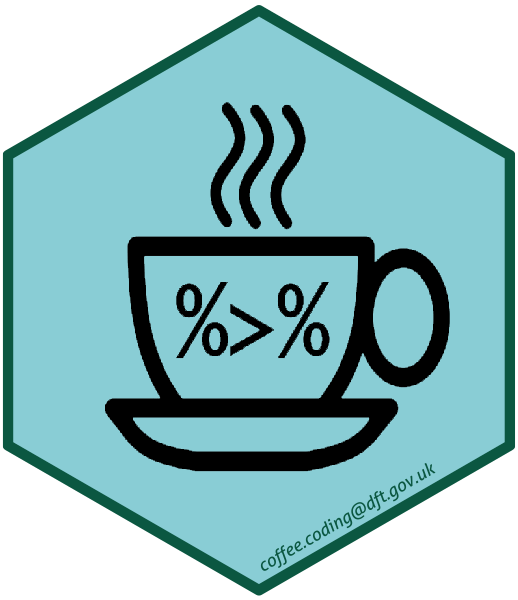



# Coffee & Coding
### _14/02/2019_

A _public_ repository to hold resources and notes from Coffee & Coding sessions.

Get in touch at: coffee.coding@dft.gov.uk

### Contributing 
Note that resources are _publicly accessible_. When adding new content clone or fork the repo, work on a branch, and submit a pull request. 

Folders should adhere to the following conventions:

* sit in the **All_materials** folder
* name of folder should be `YYYYMMDD_Topic_Name`
* all folders should contain a `README.md` with a brief explanation, and a DownGit link to download the subfolder

DfE have guidance on using GitHub via the Git GUI and HTTPS [here](https://github.com/dfe-analytical-services/coffee-and-coding/blob/master/how-to-use-github.md). For those who want a more in depth R focussed tutorial we recommend [happy git with r](https://happygitwithr.com/) by Jenny Bryan et al of the University of British Columbia.

### Aim
The aim of the Coffee & Coding meetups is to nurture, enable and encourage a vibrant, supportive and inclusive coding community at DfT. Coffee & Coding provides a regular opportunity for people within DfT who are interested in coding to share skills and knowledge, provide advice and guidance to each other and generally network and get to know each other. The format is generally 40 minutes for a presentation and questions to the presenter/s followed by 20 minutes Code Surgery. The presentations usually take the form of a demonstration of a tool or technique and/or a show and tell of work done within the department using these methods. From time to time we will invite external speakers. The Code Surgery provides the opportunity for people to pose any coding related queries/ruminations/ideas to the gathered coding community.

### Coffee & Coding Schedule

| Date            | Time  | Room    | Title                                                        | Presenter                                     | Abstract                                                     |
| :-------------- | :---- | :------ | :----------------------------------------------------------- | :-------------------------------------------- | :----------------------------------------------------------- |
| Wed 05 Feb 2020 | 11:00 | 2/16   | Animated charts in R | Lucy Charlton  |Lucy Charlton from ORR will talk about different ways of presenting data using ggplot2 in R. This will look at the types of graphs that are possible, and creating animated charts and gifs for Twitter. |
| Thu 16 Jan 2020 | 11:00 | 2/16   | Spatial analysis and producing maps in R | Jack Marks | Jack Marks will give an introduction to conducting spatial analysis and producing maps in R using the sf and tmap packages.|
| Wed 16 Oct 2019 | 11:00 | H3     | Webscraping rail fares in python | Greg Williams  | Showcasing work on webscraping fares information from the National Rail Enquiries website using python - including building a URL, making website requests, parsing HTML/JSON data and converting to csv. |
| Wed 02 Oct 2019 | 11:00 | H5     | Brandwatch | Sam Fowler | Using Brandwatch for real time data extraction projects, demonstrating the construction of queries and discussing the principals of extracting large amounts of news articles from multiple web sites. |
| Wed 18 Sep 2019 | 11:00 | H3     | Can {drake} RAP? (R) | Matt Dray | At its simplest, the {drake} package records the dependencies between the files in your analysis. If you change something, {drake} only re-runs the parts that need to be re-run, saving time and reducing the chance for error. This could be especially useful for Reproducible Analytical Pipelines (RAP) in a government context. |
| Thu 29 Aug 2019 | 11:00 | H3     | Web apps in Flask (Python) | Zachary Arundel | How to create a simple web application with Python, Javascript and Flask|
| Wed 21 Aug 2019 | 11:00 | H3     | Code surgery: SQL | Thomas Parry | Drop in session - come along and ask us any coding related question - main focus on SQL |
| Thu 15 Aug 2019 | 11:00 | H3     | Code surgery: Spatial Analysis in R | Zachary Arundel | Drop in session - come along and ask us any coding related question - main focus on spatial anaylsis |
| Wed 07 Aug 2019 | 11:00 | H3     | Plotly and interactive charts in R | Hannah Bougdah, Alex Ma |This session will present an overview of using the interactive graphing library Plotly in R. Find out how to present your data in beautiful ways and explore your data interactively and more in-depth. We will be showing both an easier and more advanced way of doing this so suitable for all levels. |
| Thu 01 Aug 2019 | 11:00 | H3     | Sentiment analysis in R workshop | Kian Chapman-Raafat |All welcome, +laptop. This will  be an unstructured drop in session with the focus on the sentiment analysis tools available in R or Python.  |
| Thu 24 Jul 2019 | 11:00 | H6     | Spatial Analysis in R | Matthew Tranter | This session will present a basic introduction to spatial analysis in R using the sf and tmap packages, from the perspective of an R novice.|
| Thu 10 Jul 2019 | 11:00 | H5     | Quick-fire SQL | Thomas Parry, Mike Dark, Paul Baden | This will cover useful SQL techniques that tend to get missed in introduction courses. This should interest anybody who uses SQL but doesn’t have much experience.|
| Thu 04 Jul 2019 | 11:00 | H5     | Workshop/Surgery: Connecting R to SQL | Tamsin Forbes | This builds on the earlier presentation of the same name. Focus on using DBI to connect R to other programmes/databases. |
| Wed 26 Jun 2019 | 11:00 | H2     | Deriving aircraft fleet parameters using R | Dharmender Tathgur | Dharmender uses R to fuse different databases in order to produce parameters that go into the Fleet Mix Model. These parameters go through several steps of QA and contextualisation to be realised. |
| Thu 20 Jun 2019 | 12:30 | H2     | Workshop/Surgery on importing files into R | Tamsin Forbes | This follows on from the last presentation, come along and practise using dummy data, or bring your own files and/or other data import issues. |
| Fri 14 Jun 2019 | 11:00 | H6     | Importing files into R | Tamsin Forbes | Main focus on excel, reading and combining data from single/multiple worksheets/workbooks. Includes using purrr to iterate over bespoke functions. |
| Thu 06 Jun 2019 | 14:00 | H6     | Webscraping in R | Johannes Schulz-Knappe | Johannes will be giving us an introduction to webscraping in R. He will present on the main forms of webscraping, useful packages and will show a few examples of webscraping in practice. |
| Wed 15 May 2019 | 11:00 | 3/23     | R in the Analytics Unit | Tim Taylor | Tim Taylor will give a tour through some of the use cases of R in the Analytics Unit (part of the newly formed Analytics and Data Division). |
| Wed 01 May 2019 | 14:00 | H4     | OOP via DnD | Sam Fowler | Sam Fowler will be talking on Object-Oriented Programming (OOP) as Explained by Dungeons and Dragons.|
| Thu 25 Apr 2019 | 11:00 | H3     | Intro to Git | David Sands   | David Sands will demonstrate how to Git it on without a command-line.|
| Wed 17 Apr 2019 | 11:00 | H2      | Object-oriented analysis & BBplot | Edwin Lowther          | Edwin Lowther, BBC journalist, will cover how the BBC uses object-oriented software design principles in data analysis and visualises the results using ggplot2 and its custom R package [bbplot](https://github.com/bbc/bbplot). |
| Thu 11 Apr 2019 | 11:00 | H3      | Choropleth Maps in R          | Isi Avbulimen                     | In this session, Isi Avbulimen will be re-running her demonstration on how to create simple choropleth maps in R and how you can customise them in (almost) any way you want. |
| Wed 03 Apr 2019 | 11:00 | H2      | BQ with Python & R  | Kim Brett & Tamsin Forbes | Using Python and R to execute SQL in Google Cloud Platform's BigQuery |
| Thu 28 Mar 2019 | 11:00 | H6      | Python Basics workshop             | Kian Chapman-Raafat                      | Learn the basics of Python - Bring your laptop!  |
| Wed 20 Mar 2019 | 10:30 | H2      | Code Surgery             | Tamsin Forbes                      | Bring along your laptop and a coding problem and we collectively try and fix it. |
| Tue 12 Mar 2019 | 10:00 | H2      |   Knitting machines   |  Duncan Garmonsway     | Knitting machines: What really happens when you render an R Markdown document, and how I have been trying to teach it the GOV.UK Design System.|
| Wed 06 Mar 2019 | 11:00 | H2      | R Basics Workshop: ggplot2   |  Andrew Kelly |  Introduction to ggplot2  |
| Tue 26 Feb 2019 | 11:00 | H4      | Automated testing in R with testthat | Peter Curtis | Automated testing means your code is easier to write, easier to improve and easier to review.  I will introduce the general principles of a test-driven development workflow and how this will benefit your work. The most commonly used package for testing in R is testthat.  I will work through an example where I use testthat in the development of an implementation of a simple greedy algorithm. |
| Thu 21 Feb 2019 | 11:00 | H4      | One-sided matching of two sets based on preferences | [Avision Ho](https://github.com/avisionh) | Consider that you have a set of people going to a conference and a set of talks taking place simultaneously. Each person cannot go to more than one talk but they have preferences over which talk they want to attend. How do you efficiently match people to talks based on their preferences? Based on a true story. This talk will describe how the problem was tackled and briefly outline the ongoing project in making it useful for wider business by turning it into an R Shiny app using a range of free, open-source collaborative data science and project management tools. Talk is available on GitHub pages [here](https://avisionh.github.io/Preference-Allocation/#1) and work-in-progress Shiny app is available [here](https://avisionh.shinyapps.io/preference20allocation/). To see the live development of the Shiny app alongside the code, please access the public Azure DevOps project [here](https://avisionh.visualstudio.com/Preference%20Allocation) |
| Wed 13 Feb 2019 | 11:00 | H4      | Developing Apps on the Google Cloud Platform, Project CheckOut | Gemma Currie,  Jonathan Pagel and Howard Pang | Digital Service will be sharing their journey and learnings of developing on the Google Cloud Platform (GCP). CheckOut is being built by an apprentice led team and is one of several Digital Service teams currently building applications on GCP. |
| Mon 4 Feb 2019  | 11:00 | H5      | R Basics Workshop  | Olena Plaksa  | Getting started and intro to tidyverse   |
| Wed 30 Jan 2019 | 11:00 | H2      | SQL/Exel to R  | David Sands  | You have likely seen analytical work being done in R. If you want to enter this world of R, but feel intimidated by it, this talk is for you. We will show you how to quickly and painlessly: (1) Connect R to your SQL database (2) Pull SQL data into R (3) Replace SQL statements using dplyr commands (4) Replace presentation of data in Excel with DataTables. So that you can start livin’ it up in R world. |
| Wed 23 Jan 2019 | 11:00 | H2      | Journey Planner data in R | Sarah Rae  | An overview of the tools for working with multimodal journey planner data, and how they can be applied to analysis. |
| Wed 16 Jan 2019 | 11:00 | H4      | RAP Validation    | Thomas Parry  |   A look at the early stages of developing a validation / QA system for ready-to-go tables in R, along with an overview of a RAP journey so far.  |
| Wed 9 Jan 2019  | 11:00 | H4      |          |                    |                            |
| Wed 12 Dec 2018 | 11:00 | 2/28a   | Statistics API mini-hackathon   | Luke Vincent & Hannah Bougdah                 | We’re proud to announce that our prototype Statistics API service is ready to experiment with. And we want to give you early access! Bring your laptop and we will show you how to get started using the API service. |
| Wed 5 Dec 2018  | 11:00 | 2/26,27 | Think People Dashboard                                       | Sara Smith & Lizzie Baggott                   | Sara & Lizzie will take us through their development journey of creating DfT’s first organisation wide Shiny App |
| Wed 28 Nov 2018 | 12:30 | 5L      | Crosstalk                                                    | Matthew Dray (GDS)                            | Shiny-like without Shiny                                     |
| Wed 21 Nov 2018 | 11:00 | H1      | dfeR                                                         | Adam Robinson (DfE)                           | Adam from the Department for Education will take us through how he developed an R package to help standardise R programming across the department |
| Wed 14 Nov 2018 | 12:30 | 5L      | R to SQL with DBI                                            | Tamsin Forbes                                 | Connecting to SQL, materials adapted from a session by Cathy Atkinson from BEIS |
| Wed 7 Nov 2018  | 12:30 | H6      | Developing a Statistics API                                  | Luke Vincent + Nico Kronberg                  | We are developing a Statistics API service to make data easier to access. Starting with Search and Rescue data then moving on to Road Accidents |
| Wed 31 Oct 2018 | 13:00 | H6      | Coding Surgery                                               |                                               | Bring along your laptop and a coding problem and we collectively try and fix it |
| Thu 18 Oct 2018 | 11:00 | 3/23    | Software Development Tools for Analysts using R              | Will Bowditch                                 | An overview of tools that help you write robust and maintainable R code |
| Wed 10 Oct 2018 | 12:30 | 5L      | (Almost) Fully Customisable Choropleth Maps in R             | Isi Avbulimen                                 | Demo on how to produce choropleth maps in R that be customised in (almost) any way you want |
| Wed 03 Oct 2018 | 12:00 | H3      | Interactive Trade Data Visualisation                         | Louis Tsiattalou (BEIS)                       | How I saved the Food Standards Agency hundreds of work-hours with a Shiny App for HMRC’s Trade Statistics |
| Wed 26 Sep 2018 | 14:00 | H2      | rmarkdown                                                    | Suzanne Wallace                               | All the weird and wonderful things that you can do with R Markdown |
| Wed 19 Sep 2018 | 12:00 | H6      | stringr                                                      | Tamsin Forbes                                 | Demo of stringr R package and regular expressions            |
| Wed 29 Aug 2018 | 10:00 | H2      | ggplot2                                                      | Andrew Kelly & Edisa Livingstone              | Demo of ggplot2 R package and DfT theme                      |
| Mon 23 Jul 2018 | 10:00 | H5      | SQL tips                                                     | Amardeep Dhani & Delphine Robineau            | Using SQL to calculate straight line distances and SQL tips and tricks |
| Wed 27 Jun 2018 | 14:30 | H4      | tidyverse                                                    | Tamsin Forbes                                 | Intro to R tidyverse packages with pokemon                   |
